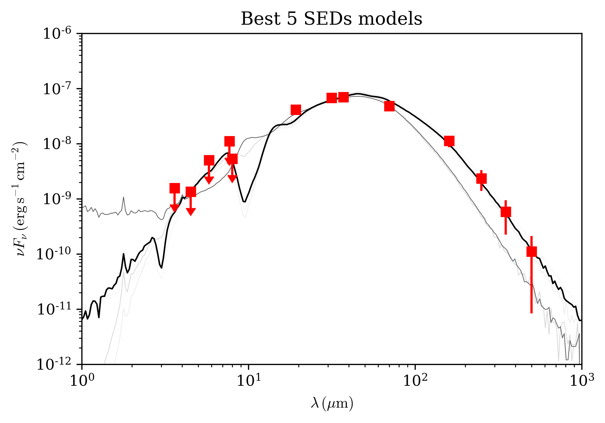
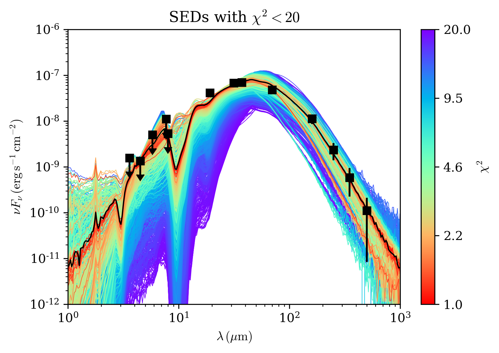
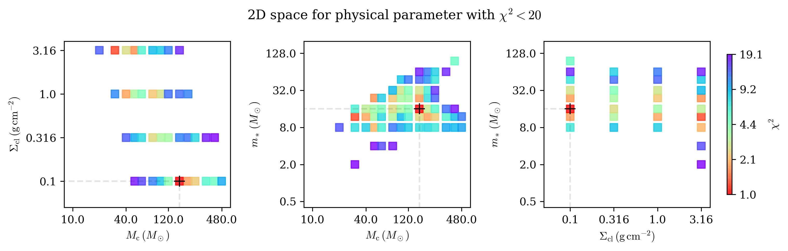

************
SedFitter
************

Introduction
------------

SedFitter is a class with a number of convenience functions to fit the measured fluxes input by the user.

Starting the SedFitter object
^^^^^^^^^^^^^^^^^^^^^^^^^^^^^

First of all we need to initialise an ``SedFitter`` object with an extinction law (default 'kmh', `Kim et al 1994 <https://ui.adsabs.harvard.edu/abs/1994ApJ...422..164K/abstract>`__), and the arrays to be used in the fit, i.e. wavelength, flux, error flux (in percentage), identify upper limits, and the filter names for each wavelength used::

    >>> from sedcreator import SedFitter
    >>> source_sed = SedFitter(extinction_law,source_wave,source_flux,source_flux_err,source_uplim,source_filter)

With this class initialised we can now fit the observed SED by setting the distance to the source (dist), the maximum visual extinction one wants to explore, and the fitting method

    >>> source_sed_results = source_sed.sed_fit(dist=source_dist,AV_max=AV_max,method=method)

In this way, the results from the SED fit will be stored in source_sed_results.
From this object we can retrieve the tables with physical parameters, together with its chisq, for each model.

    >>> source_models_3p = source_sed_results.get_model_info(keys=['mcore','sigma','mstar'],
    ... tablename='table_432models.txt')    
    >>> source_models_4p = source_sed_results.get_model_info(keys=['mcore','sigma','mstar','theta_view'],
    ... tablename='table_8640models.txt')

Below one can find an example:

We first need to define the arrays to be input in the ``SedFitter`` class. That is 

* source_wave, wavelength array in micrometers

* source_flux, flux array in Jy

* source_flux_err, error in the flux array in Jy

* upp_limit as a boolean array, 1 (or True) for upper limit and 0 (or False) for non upper limit.

* filter_name array of string with the name of the filter (see below to retrieve the filter names)

 We are going to use the data for the SOMA source AFGL437::

    >>> from sedcreator import SedFitter
    >>> import numpy as np

    >>> wavelength = np.array([3.6,4.5,5.8,8.0,
    ... 7.7,19.2,31.5,37.1,
    ... 70.0,160.0,250.0,350.0,500.0]) #micron
    >>> flux = np.array([1.8835,2.0301,9.8080,14.3600,
    ... 28.4727,266.4529,718.3385,865.5905,
    ... 1126.7534,603.8391,197.4299,68.2472,18.4542]) #Jy
    >>> error_flux = np.array([0.1983,0.2093,1.0533,1.6109,
    ... 2.8472,26.6452,71.8338,86.5590,
    ... 114.4470,141.3799,80.8373,42.1264,17.0529]) #Jy
    >>> upp_limit = np.array([1,1,1,1,
    ... 1,0,0,0,
    ... 0,0,0,0,0],dtype=bool)
    >>> filter_name = np.array(['I1','I2','I3','I4',
    ... 'F4','F8','L1','L4',
    ... 'P1','P3','P4','P5','P6'])

    >>> source_sed = SedFitter(extc_law='kmh',lambda_array=wavelength,flux_array=flux,err_flux_array=error_flux,
    ... upper_limit_array=upp_limit,filter_array=filter_name)

We know need to call the ``sed_fit()`` function to fit out observations, but first we need to define also the distance to the source in pc, the maximum visual extinction (AV) in mag we are going to allow the fit, and the method (the default and recomended is 'minimize'::

    >>> distance = 2000.0 #pc
    >>> AV_max = 1000.0 #mag

    >>> source_sed_results = source_sed.sed_fit(dist=distance,AV_max=AV_max,method='minimize')

Once the fit is done, we can retrieve the best models ordered by chisq using the function ``get_model_info()``. One can save the table setting tablename (e.g. tablename='se_results.txt'. We can either retrieve the 432 physical models or the full 8640 model grid::

    >>> source_models_3p = source_sed_results.get_model_info(keys=['mcore','sigma','mstar'],
    ... tablename=None)
    >>> source_models_4p = source_sed_results.get_model_info(keys=['mcore','sigma','mstar','theta_view'],
    ... tablename=None)
    >>> print(source_models_3p)

     SED_number   chisq   chisq_nonlim mcore ...   lbol   lbol_iso lbol_av  t_now  
    ----------- --------- ------------ ----- ... -------- -------- ------- --------
    10_01_07_13   1.03751      1.49863 160.0 ...  33070.0  14990.9 14990.9 351681.0
    03_04_06_08   1.33344      2.16684  30.0 ...  49398.0  14558.3 14558.3  37037.1
    05_04_08_12   1.78488      2.32034  50.0 ... 189194.0  20215.2 13956.7  46624.5
    10_01_08_19   1.87692       2.7111 160.0 ...  78272.7  18702.0 15111.3 445867.0
    11_01_06_05   1.92099      2.27027 200.0 ...  19867.8  14905.2 14905.2 282819.0
    04_03_06_07   1.96639      3.19538  40.0 ...  45437.1  13668.2 13668.2  79533.3
    05_04_05_03   2.14913      2.79387  50.0 ...  16605.8  16419.7 14829.3  24991.8
    07_03_08_10   2.34448      3.38647  80.0 ... 119307.0  15346.0 15346.0  96353.8
    12_01_06_05   2.43187      3.95178 240.0 ...  20164.6  15573.8 15573.8 270376.0
    10_01_06_06   2.65884      3.84054 160.0 ...  18682.5  12345.3 12345.3 300765.0
            ...       ...          ...   ... ...      ...      ...     ...      ...
    12_04_09_19   94.6027    153.72938 240.0 ... 499180.0 172532.0 18282.2  34554.7
    13_04_07_20 100.75891    163.73323 320.0 ... 105890.0  86892.2 15410.4  21618.7
    12_04_08_20  107.7167    175.03964 240.0 ... 305090.0 165763.0 18974.2  28988.0
    15_03_11_20 117.10834    190.30105 480.0 ... 840671.0 224767.0 21481.3  96234.4
    14_04_07_20 130.87295    212.66855 400.0 ... 100019.0  86709.4 16847.4  20419.5
    15_03_08_20 134.14571    217.98678 480.0 ... 209275.0 158881.0 21273.7  57128.0
    15_03_10_18 138.66091    225.32398 480.0 ... 542510.0 215944.0 22916.7  81745.5
    15_03_09_20 139.97722    227.46298 480.0 ... 295187.0 180302.0 22251.5  66146.5
    13_04_08_20 203.11438    330.06087 320.0 ... 308717.0 208355.0 25327.6  27164.7
    14_04_08_20 315.53159    512.73883 400.0 ... 300819.0 233829.0 30459.1  25087.5
    15_04_08_20 417.18007    677.91762 480.0 ... 293984.0 242873.0 33913.8  23942.2
    Length = 432 rows

Now, we can generate very interesting plots to show our data and the best models. To do that we need first to initilise the ``ModelPlotter`` class with the object from the sed_fit::

    >>> from sedcreator import ModelPlotter
    >>> md = ModelPlotter(source_sed_results)

It is very simple then to plot, for example the best 5 SEDs from the 432 physical models::

        >>> md.plot_multiple_seds(source_models_3p[0:5],xlim=[1e0,1e3],ylim=[1e-12,1e-6],
        ... title='Best 5 SEDs models',marker='rs',cmap='gray',colorbar=False,figname=None)

Let's also do a more colorful plot by plotting all SED with a chisq<20, considering this time the 8640 models::

        >>> md.plot_multiple_seds(source_models_4p[source_models_4p['chisq']<20.0],
        ... xlim=[1e0,1e3],ylim=[1e-12,1e-6],title=r'SEDs with $\chi^2<20$',marker='ks',cmap='rainbow_r',colorbar=True,
        ... figname='myfirstSED_plot.pdf') #or .png, .eps, or your favourite format.

It is also interesting to plot the 2D distribution of the 3 main parameters of the model, i.e., m*, sigma_cl, and M_c::

    >>> md.plot2d(source_models_4p[source_models_4p['chisq']<=20.0],
        ... title='2D space for physical parameter with $\chi^2<20$',
        ... figname=None)

To check the name of the filter::

    >>> SedFitter().print_default_filters

    filter wavelength   instrument  
    ------ ---------- --------------
        2J        1.2          2MASS
        2H        1.6          2MASS
        2K        2.2          2MASS
        I1        3.6   Spitzer_IRAC
        I2        4.5   Spitzer_IRAC
        I3        5.6   Spitzer_IRAC
        I4        8.0   Spitzer_IRAC
        M1       24.0   Spitzer_MIPS
        M2       70.0   Spitzer_MIPS
        M3      160.0   Spitzer_MIPS
        F1        5.4  SOFIA_FORCAST
        F2        6.4  SOFIA_FORCAST
        F3        6.6  SOFIA_FORCAST
        F4        7.7  SOFIA_FORCAST
        F5        8.6  SOFIA_FORCAST
        F6       11.1  SOFIA_FORCAST
        F7       11.3  SOFIA_FORCAST
        F8       19.2  SOFIA_FORCAST
        F9       24.2  SOFIA_FORCAST
        L1       31.5  SOFIA_FORCAST
        L2       33.6  SOFIA_FORCAST
        L3       34.8  SOFIA_FORCAST
        L4       37.1  SOFIA_FORCAST
        P1       70.0  Herschel_PACS
        P2      100.0  Herschel_PACS
        P3      160.0  Herschel_PACS
        P4      250.0 Herschel_SPIRE
        P5      350.0 Herschel_SPIRE
        P6      500.0 Herschel_SPIRE
        R1       12.0           IRAS
        R2       25.0           IRAS
        R3       60.0           IRAS
        R4      100.0           IRAS
        W1        3.4           WISE
        W2        4.6           WISE
        W3       12.0           WISE
        W4       22.0           WISE
        S1      450.0          Scuba
        S2      850.0          Scuba
