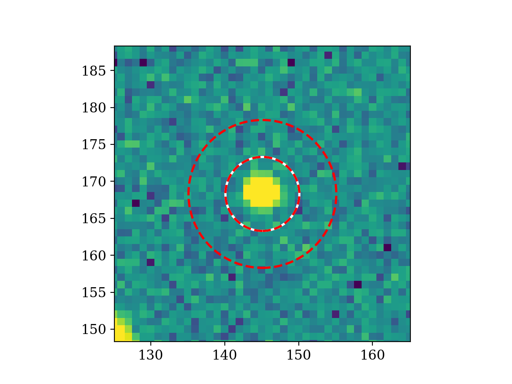
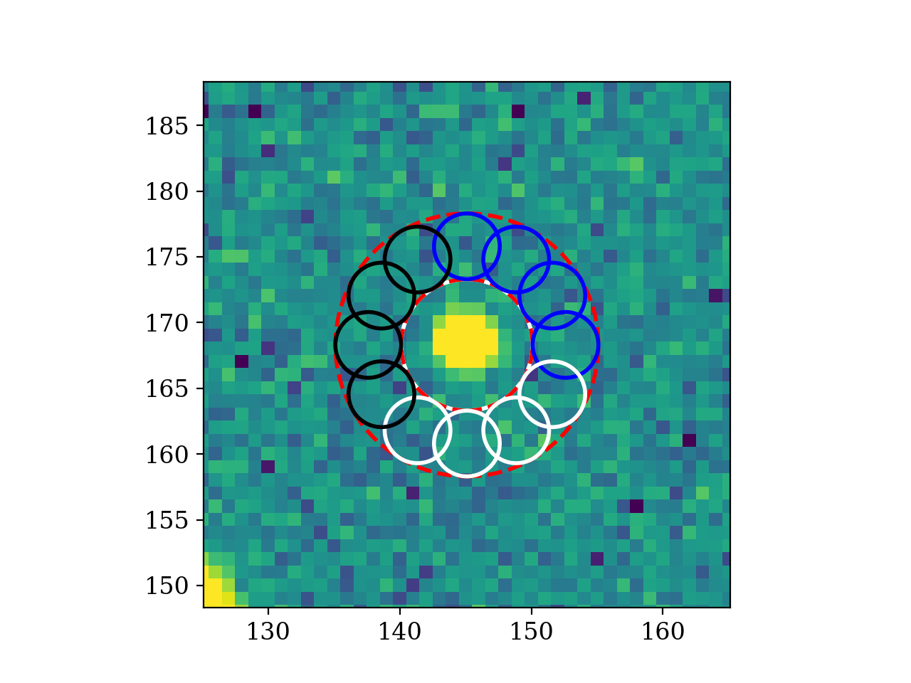
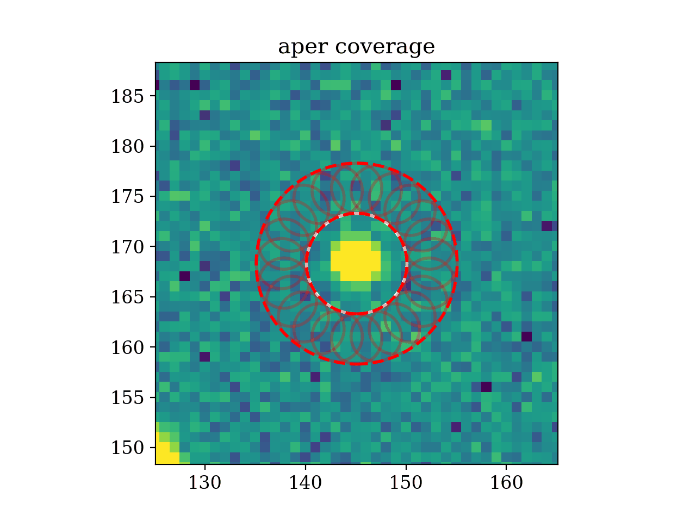

**********************
Error estimation
**********************

Introduction
------------

Here we give some further explanation on how ``SedFluxer get_flux`` function estimates the error. Recall that ``get_flux()`` ingests four inputs (but also ``get_raw_flux()``):

* central_coords
* aper_rad
* inner_annu
* outer_annu

And it will return four outputs, these are:

* Background-subtracted flux, flux_bkg
* Flux without backgroun subtraction, flux
* Fluctuation error, error_fluc
* Background, bkg

    >>> flux_bkg, flux, error_fluc, bkg = get_flux(central_coords,aper_rad,inner_annu,outer_annu)

Background
----------

To calculate the background, we simply consider the median value within the annulus and multiply it by the area of the main aperture. In this way, we assume that the background is uniform over the main aperture and that it is well represented by the median value of the annulus. We use this estimation to the background subtract from the flux measured in the main aperture to obtain the background-subtracted flux.

Fluctuation Error Method
------------------------

For this error estimator method, the fluctuations on the flux in a region from the annulus equivalent to the main aperture is evaluated. Therefore, the annulus regions is divided into three sectors with equal area than the circle for the main aperture with radius :math:`r`. Recall that the fiducial case for annulus definition is to take :math:`r_\mathrm{inner}=r$ and $r_\mathrm{outer}=2r`. Therefore the area of each of the three sectors (:math:`\pi(r_\mathrm{outer}^2-r_\mathrm{inner}^2)/3=\pi r^2`) is equal to the area of the main aperture (:math:`\pi r^2`). To simplify, each sector is approximated by four circles with radius :math:`r/2` (which sum an area of :math:`4\pi(r/2)^2=\pi r^2`), colored in blue, white, and black. We then estimate the fluctuation of the three sectors by calculating the standard deviation in their measurements.

In order to avoid bias and missing regions within the annulus, the three sectors are aliased 6 times, from 0 to 75 degrees in steps of 15 degrees, to cover the full annulus. For each aliased position, the standard deviation of the measurement of the three sectors is calculated. Finally, the mean value of the six standard deviations is calculated and considered as the fluctuation error.

