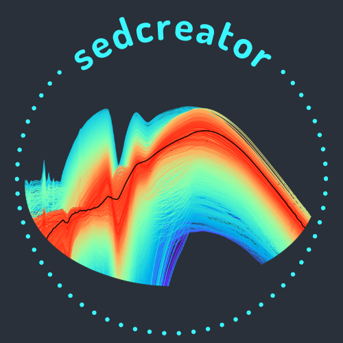

.. the "raw" directive below is used to hide the title in favor of
   just the logo being visible
.. raw:: html

    

.. |br| raw:: html

    

***************
sedcreator
***************

**sedcreator** helps you to construct your spectral energy distribution
by providing tools to measure fluxes on any image. It also provides a set
of models to fit your SED with massive star formation models.
It is an open source Python package.

.. rst-class::  clear-both

.. Important::
    If you use **sedcreator** for a project that leads to a publication,
    whether directly or as a dependency of another package, please
    include an :doc:`acknowledgment and/or citation <citation>`. Please include also credit
    the python packages that sedcreator depends on.

.. warning::
    This package is under active development.

.. toctree::
   :maxdepth: 1
   :caption: Contents:

Getting Started
===============

.. toctree::
    :maxdepth: 1

    install.rst
    citation.rst
    license.rst

User Documentation
==================

.. toctree::
    :maxdepth: 1

    SedFluxer.rst
    optimal_aperture.rst
    error_estimation.rst
    SedFitter.rst
    filters.rst
    average_model.rst
    sedcreator.rst

Indices and tables
==================

* :ref:`genindex`
* :ref:`modindex`
* :ref:`search`