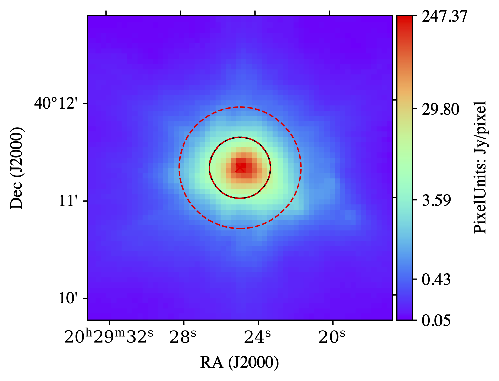
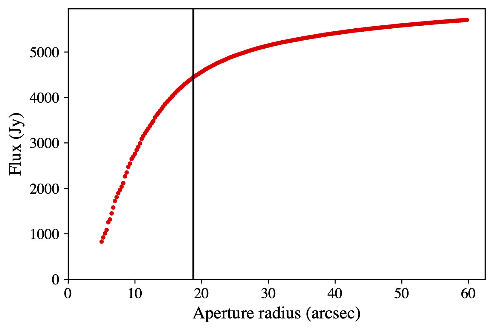

**********************
Optimal Aperture
**********************

Introduction
------------

``get_optimal_aperture()`` is a function that helps you define the optimal aperture to perform photometry using the tools outlined in ``SedFluxer``.

This algorithm aims to provide aperture sizes that are reproducible and that are chosen in a algorithmic way. The algorithm selects the optimal aperture radius for a given image through the following process. First, it samples a list of radii within a user-defined lower and upper boundary, using a step size. Next, it calculates the background-subtracted flux enclosed by each sampled aperture, that perform aperture photometry for a given radius (using the fiducial method of subtracting the median value from an annulus with width equals to the radius of the aperture), centered on the source coordinates provided by the user. The algorithm then begins to loop through the sampled radii and their associated fluxes, starting from the smallest radius. At each point, it tests whether a percent radius increase chosen by the user (30\% is the default) results in a background-subtracted flux increase less than or equal to another percentage chosen by the user (with a default of 10\%). So, in the default case, the algorithm increases 30\% in radius (or to the sampled point closest to this) and checks whether or not the flux is less than 10\% larger at this point. This would indicate that the amount of source flux to be gained by further increasing this radius is small and comes at the cost of introducing more noise. When this condition is satisfied, the iteration stops, and the algorithm returns the corresponding optimal aperture radius. More explanation.

Let's visualise it!

|pic1| |pic2|

.. |pic1| image:: _static/fluxer.gif
   :width: 45%

.. |pic2| image:: _static/fluxer_profile.gif
   :width: 54%

To use the function, we just need to initialise the ``SedFluxer`` object with the image of interest and call the function, defining the central coordinates where we want to find the optimal aperture and the rest of parameters::

    >>> from sedcreator import SedFluxer
    >>> from astropy.io import fits as pyfits
    >>> from astropy.coordinates import SkyCoord
    >>> import astropy.units as u

    >>> filename = '../examples/AFGL2591_data/AFGL2591_Herschel_70.fits'

    >>> hdu = pyfits.open(filename)[1]

    >>> AFGL2591_coords = SkyCoord(ra='20h29m24.8916s', dec='+40d11m19.388s', frame='fk5')
    >>> AFGL2591_fluxer = SedFluxer(hdu)

    >>> aperture_radius = AFGL2591_fluxer.get_optimal_aperture(central_coords=AFGL2591_coords, ap_inner=5.0, ap_outer=60.0,
    ...                                                        step_size=0.25, aper_increase=1.3, threshold=1.1,
    ...                                                        profile_plot=False)
    
    >>> AFGL2591_H70 = AFGL2591_fluxer.get_flux(central_coords=AFGL2591_coords,
    ...                                            aper_rad=aperture_radius,inner_annu=1.0*aperture_radius,
    ...                                            outer_annu=2.0*aperture_radius)
    
    >>> AFGL2591_H70.plot(cmap='rainbow')

One can also generate the plot of enclosed flux version radius by setting ``profile_plot=True``::

    >>> aperture_radius = AFGL2591_fluxer.get_optimal_aperture(central_coords=AFGL2591_coords, ap_inner=5.0, ap_outer=60.0,
    ...                                                        step_size=0.25, aper_increase=1.3, threshold=1.1,
    ...                                                        profile_plot=True)

And print the value::

    >>> print('Optimal aperture is',aperture_radius,'arcsec')
    Optimal aperture is 18.75 arcsec
